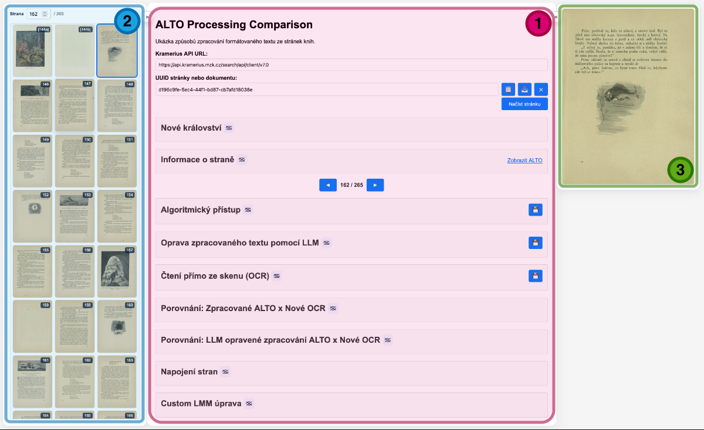
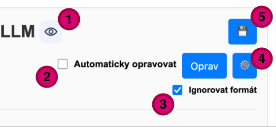

# Alto Processing

Alto Processing je open source prostředí pro experimenty a porovnávání různých přístupů ke zpracování historických dokumentů, jejich ALTO XML, textu a skenů stránek. Umožňuje na jednom místě zkoušet různé technologie, srovnávat jejich výsledky a průběžně ověřovat, co v praxi funguje lépe.

Projekt dnes kombinuje především algoritmické zpracování ALTO, LLM korekce, OCR experimenty a export výsledků do formátů `txt`, `html`, `md` a `epub`. Součástí je i webové rozhraní, které pomáhá jednotlivé varianty a jejich kombinace přehledně porovnávat nad konkrétní knihou nebo stránkou a usnadňuje kontrolu kvality výstupu.

## Implementované funkce

- porovnávání algoritmických technologií pro převod ALTO do čitelného formátovaného textu
- experimenty s LLM korekcemi zpracovaného formátovaného textu
- testování kvality nových OCR modelů s porovnáním s dosavadním přístupem
- způsoby napojování jednotlivých stránek za sebe do jednolitého textu
- custom využití LMM modelů pro práci s textem
- rychlé ověřování kvality nad konkrétní knihou nebo stránkou z Krameria MZK
- export všech výsledků do běžně použitelných formátů včetně `epub`

## Použití nasazené instance

Tato instance je nasazená na adrese:

`https://alto-processing.trinera.cloud/`

Ověřený personál s přístupovým kódem ji může používat přes REST API. Server umožňuje spouštět různé kombinace kroků zpracování nad knihou nebo stránkou a výsledkem je exportní soubor připravený ke stažení.

Typický postup má tři kroky. Nejprve se odešle požadavek na vytvoření exportu. Server okamžitě odpoví s přiřazeným `JOB_ID`, které je potřeba pro další kroky. 

Ukázka pro export do `epub`:

```bash
TOKEN="AUTH_TOKEN"
BASE="https://alto-processing.trinera.cloud"

curl -sS -X POST "$BASE/download" \
  -H "Authorization: Bearer $TOKEN" \
  -H "Content-Type: application/json" \
  -d '{
    "uuid": "uuid:06c8fc5a-eaa6-4d2b-88bf-493221045e5f",
    "format": "epub",
    "range": "all",
    "ignoreImages": false,
    "languageHint": "cs",
    "outputName": "book.epub"
  }'
```

Kontrola stavu jobu:

```bash
curl -sS "$BASE/exports/JOB_ID" \
  -H "Authorization: Bearer $TOKEN"
```

Stažení hotového výsledku:

```bash
curl -sS "$BASE/exports/JOB_ID/download" \
  -H "Authorization: Bearer $TOKEN" \
  -o book.epub
```

Podrobnější popis parametrů, dalších exportních voleb a celého API workflow je [zde](https://github.com/REPO_OWNER/REPO_NAME/wiki/API-Guide).

## Webové rozhraní

Webové rozhraní slouží k vyzkoušení, porovnávání a úpravám jednotlivých kroků zpracování. Umožňuje testovat účinnost různých přístupů, měnit konfiguraci modelů a agentů, ladit prompty nebo úroveň `reasoning` a průběžně sledovat, jak se tyto změny projeví na výsledku.

Rozhraní je rozdělené do tří hlavních částí.



- `1` Hlavní panel s jednotlivými funkčními bloky
- `2` navigace stránek knihy
- `3` náhled aktuální stránky


Hlavní panel je rozdělený do několika funkčních bloků. Jednotlivé bloky lze skrývat a znovu zobrazovat ikonou oka (1). U vybraných operací je možné zapnout automatický režim, který automaticky provede úpravu pro každou další stranu (2). Ignorování formátu textu (3) posílá ke zpracování čistý text.
Nastavení umožňuje otevřít podrobné nastavení agenta (4) a volba `Uložit` umožní stažení s využitím vybrané úpravy (5). Podrobnější vysvětlení ovládání jednotlivých kroků je [zde](https://github.com/REPO_OWNER/REPO_NAME/wiki/User-Guide).



### Jednotlivé bloky:

- Vstupní blok slouží pro zadání `UUID` knihy/strany a adresy Krameria API.
- Informační bloky zobrazují metadata o stránce a celé knize, včetně odkazu do digitální knihovny a přístupu k raw ALTO.
- Blok `Algoritmický přístup` porovnává dosavadní a novější algoritmický převod existujícího ALTO do formátovaného textu.
- `Oprava zpracovaného textu pomocí LLM` navazuje na nově zpracované ALTO. Používá uloženého agenta, tedy prompt, model a jeho další nastavení pro opravu šumu a chyb při tvoření ALTO.
- Blok `OCR` spouští vybrané OCR modely přímo nad obrazem stránky a převádí výsledek do formátovaného textu.
- Dva bloky `Porovnání` slouží k přímému srovnání jednotlivých přístupů proti OCR pomocí diffu nad výsledky.
- Blok pro napojování stran rozhoduje, zda se mají sousední strany oddělit, spojit nebo sloučit. Výsledek vrací hodnoty `0` pro `split`, `1` pro `join` a `2` pro `merge`.
- Poslední blok umožňuje vlastní využití `LLM` nad textem stránky, například pro shrnutí jednotlivých odstavců, simulaci `NER` nebo další experimentální transformace.


## Lokální spuštění

Lokální spuštění zpřístupňuje stejné webové rozhraní i API jako nasazená instance, ale ve vlastním prostředí. Pro plnou funkčnost je potřeba připravit správný `.env` soubor a doplnit do něj používané tokeny.

### Tokeny a `.env`

```bash
cp .env.example .env
```
V souboru `.env` je potřeba nastavit především:

- `ALTO_WEB_AUTH_TOKEN` pro autentizaci při přístupu do aplikace
- `OPENAI_API_KEY`, pokud mají být používány modely OpenAI
- `OPENROUTER_API_KEY`, pokud mají být používány modely přes OpenRouter
- `CERIT_API_KEY`, pokud mají být používány modely CERIT

### Závislosti
- Python 3.10+
- Node.js + npm
- Docker a Docker Compose pro kontejnerové spuštění

### Ruční spuštění

Ruční spuštění je vhodné pro lokální vývoj, ladění a přímou práci s prostředím projektu.

```bash
python3 -m venv .venv
source .venv/bin/activate

pip install --upgrade pip
pip install -r requirements.txt
npm install
./start.sh
```

Aplikace je po spuštění dostupná na:

`http://localhost:8080/`

### Kontejnerové spuštění

Kontejnerové spuštění je vhodné ve chvíli, kdy má aplikace běžet v izolovaném prostředí bez ruční instalace závislostí do systému.

```bash
docker compose up --build
```

Podrobnější technický setup, konfigurace providerů a deployment je [zde](https://github.com/REPO_OWNER/REPO_NAME/wiki/Running-Locally).
